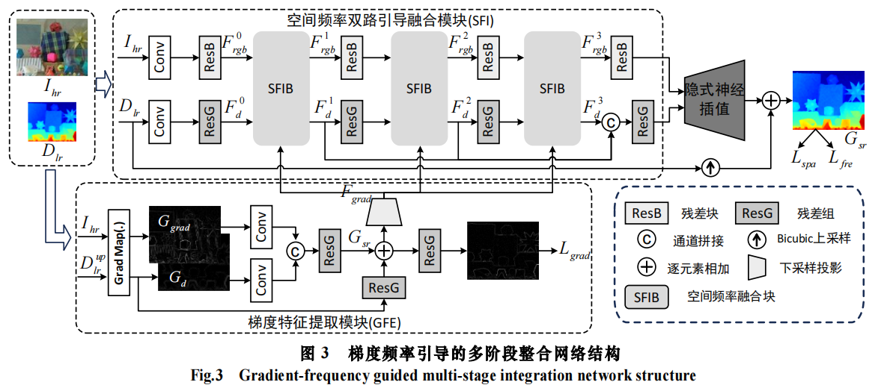

# <p align="center">基于梯度频率多阶段引导的深度图超分辨率方法</p>

## Dependencies
```
Python==3.10.1
PyTorch==1.13.0
numpy==1.23.5 
torchvision==0.13.1a0
tqdm==4.64.1
```

## Datasets
[NYU v2](https://drive.google.com/file/d/1osYRaDfMYuyiTkJwDbKl3kHwyevDLsZf/view?usp=sharing)
[RGB-D-D](https://github.com/lingzhi96/RGB-D-D-Dataset)
[Middlebury](https://web.cecs.pdx.edu/~fliu/project/depth-enhance/)

## Train on synthetic NYU v2
> python train.py --scale 4 --num_feats 32
> 
> python train.py --scale 8 --num_feats 32
> 
> python train.py --scale 16 --num_feats 32
## Train on real-world RGB-D-D
> python train.py --scale 4 --num_feats 24

## Test on NYU v2, Middlebury, RGB-D-D datasets
> python test.py --scale 4 --num_feats 32
> 
> python test.py --scale 8 --num_feats 32
> 
> python test.py --scale 16 --num_feats 32
> 
## Test on real-world RGB-D-D
> python test.py --scale 4 --num_feats 24


## Experiments

<p align="center">

</p>
<p align="center">

</p>

### Visual comparison
<p align="center">

</p>
